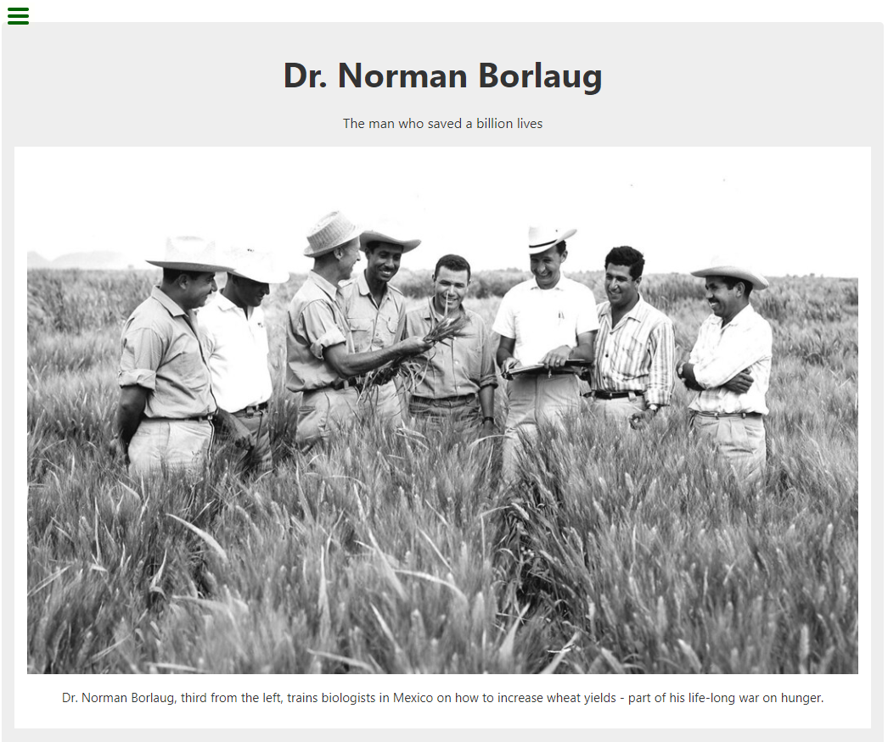
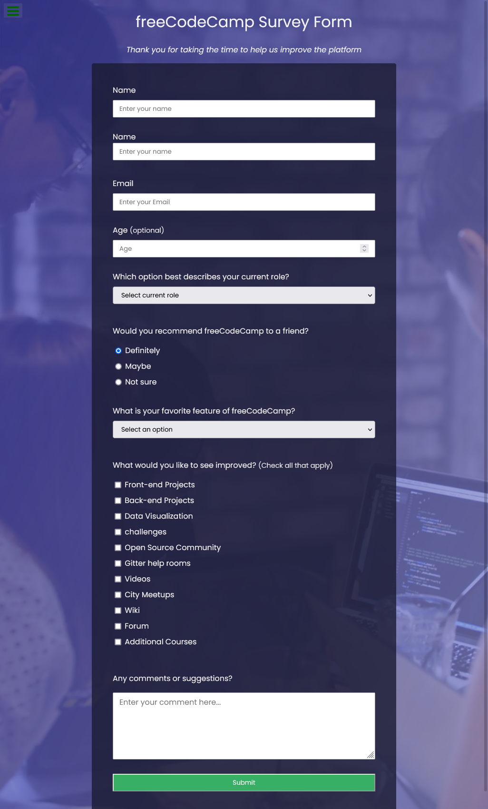
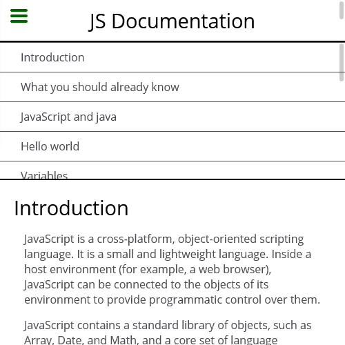
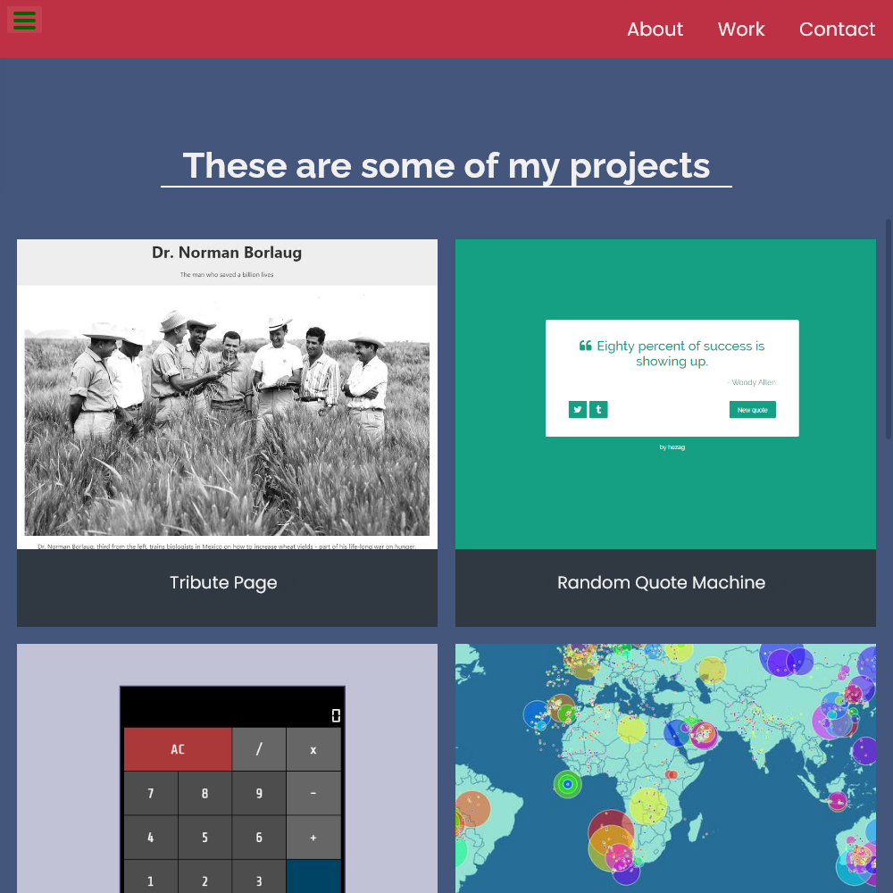

# freeCodeCamp Responsive Web Design Projects clone

Below are clones of the five [responsive web design projects](https://www.freecodecamp.org/learn/responsive-web-design/) from freeCodeCamp. Code and live sites can be found in the links below.

## Links to finished challenges

1. [Build a Tribute Page](./build-a-tribute-page)

---

2. [Build a Survey Form](./build-a-survey-form)

---

3. [Build a Product Landing Page](./product-landing-page)

---

4. [Build a Technical Documentation Page](./technical-documentation-page)

---

5. [Build a Personal Portfolio Webpage](./personal-portfolio-webpage)

---

## Contact me

**coding-guy**

- [GitHub](https://github.com/1codingguy)
- [Blog](https://blog.coding-guy.com/)
- [Twitter](https://twitter.com/1codingguy)
