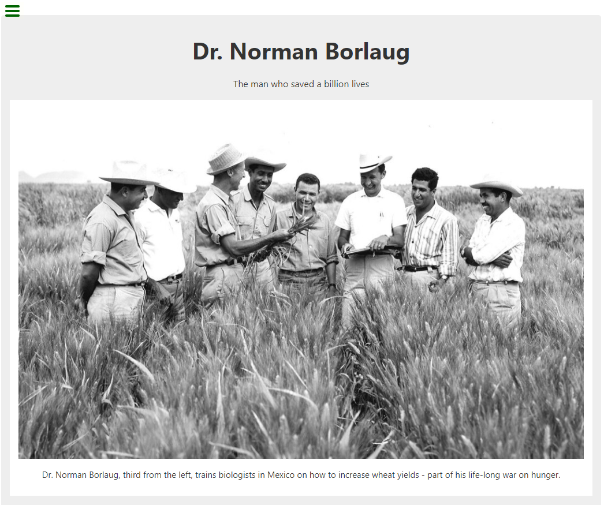

# Tribute Page - freeCodeCamp

This is a solution to the [Build a tribute page on freeCodeCamp](https://www.freecodecamp.org/learn/responsive-web-design/responsive-web-design-projects/build-a-tribute-page).

## Table of contents

- [Overview](#overview)
  - [Objective](#objective)
  - [Screenshot](#screenshot)
  - [Links](#links)
- [My process](#my-process)

  - [Technologies used](#technologies-used)
  - [Things I learned](#things-i-learned)

- [Author](#author)

## Overview

### Objective

1. Pass all the test from FCC.
2. Get the page to look as close to the original design as possible.

### Screenshot

### Links

- [Solution](https://github.com/1codingguy/fcc-responsive-projects/blob/main/build-a-tribute-page/)
- [Live Site](https://1codingguy.github.io/fcc-responsive-projects/build-a-tribute-page/)

## My process

### Technologies used

- HTML5
- SCSS

### Things I learned

1. `<strong>` tag was used for the year in each bullet point. But since the year carries no "importance" in semantic meaning, a `` tag with a class should be used, the font-boldness can then be adjusted via CSS. ([Click here](https://html.com/tags/strong/) for more on proper use of `strong` element )
2. Learnt about [BEM naming convention](http://getbem.com/naming/). Tried to impliement in this project. But since freeCodeCamp specify names of classes for some containers, couldn't completely follow the convention.

## Author

- Github - [1codingguy](https://github.com/1codingguy)
