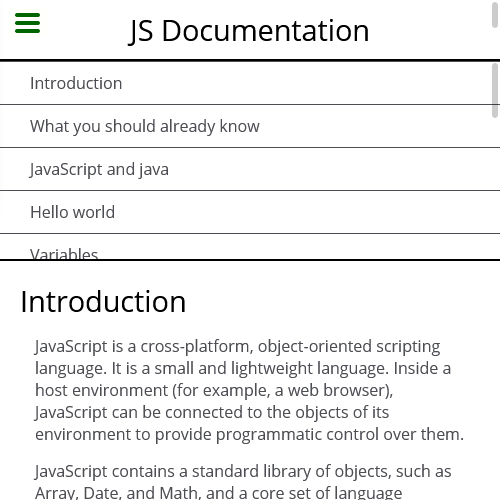

# Technical documentation page - freeCodeCamp

This is a solution to the [Build a Technical Documentation Page](https://www.freecodecamp.org/learn/responsive-web-design/responsive-web-design-projects/build-a-technical-documentation-page) from freeCodeCamp.

## Table of contents

- [Overview](#overview)
  - [Objective](#objective)
  - [Screenshot](#screenshot)
  - [Links](#links)
- [My process](#my-process)

  - [Technologies used](#technologies-used)
  - [Things I learnt](#things-i-learnt)

- [Author](#author)

## Overview

### Objective

1. Pass all the tests from FCC.
2. Get the page to look as close to the original design as possible.

### Screenshot

### Links

- [Solution](https://github.com/1codingguy/fcc-responsive-projects/tree/main/technical-documentation-page)
- [Live Site](https://1codingguy.github.io/fcc-responsive-projects/technical-documentation-page/)

## My process

### Technologies used

- HTML 5
- SCSS

### Things I learnt

#### The difference between `overflow-y: auto` and `overflow-y: scroll`:

- Auto will only show a scrollbar when any content is clipped.
- Scroll will however always show the scrollbar even if all content fits and you cant scroll it.
- Source: https://stackoverflow.com/questions/6689412/difference-between-html-overflow-auto-and-overflow-scroll#:~:text=6%20Answers&text=Auto%20will%20only%20show%20a,and%20you%20cant%20scroll%20it.

#### Which one to use given the difference above?

- It seems not much difference of using `auto` or `scroll`.
- But when considering bigger screen when the navbar is fixed on the left:
  - `overflow-y: auto` should be used since height is uncertain, there may or may not be overflow.

## Author

**coding-guy**

- [GitHub](https://github.com/1codingguy)
- [Blog](https://blog.coding-guy.com/)
- [Twitter](https://twitter.com/1codingguy)
